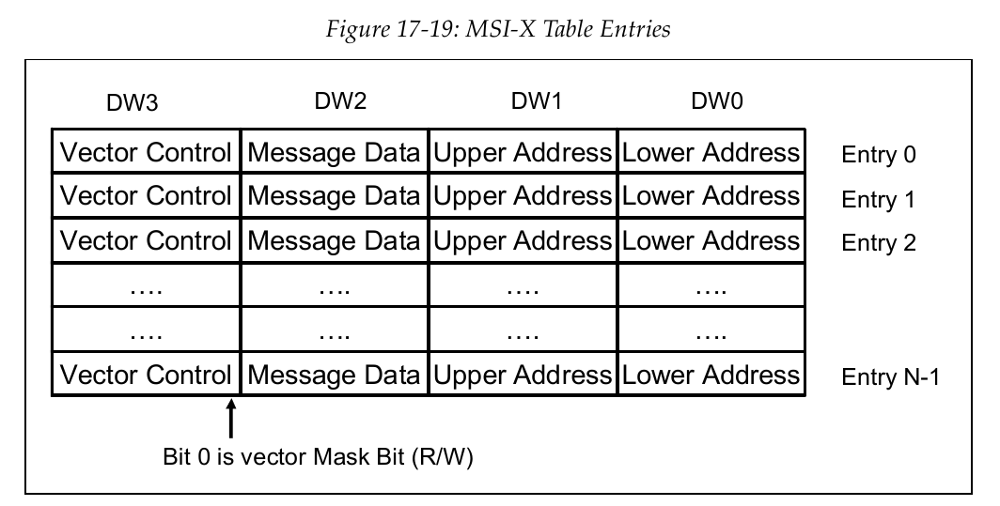

# PCI

## config 空间

每个 PCI 设备都有自己的配置空间,这个配置空间存在于 PCI 设备的内部空间中,主设备通 过 lspci 可以看到系统扫描到的所有 PCI 设备以及他们对应的配置空间。

我们可以通过lspci看到当前设备上所有的PCI设备

```bash
    $ lspci
......
03:00.0 Ethernet controller : Realtek Semiconductor Co., Ltd. RTL8111 /8168/8211/8411
PCI Express Gigabit Ethernet Controller (rev 15)
```

使用 lspci -x 就可以看到配置空间里的内容，-s 可以指定某个 PCI  设备查看。

```bash
	$ lspci -s 03:00.0 -x
03:00.0 Ethernet controller : Realtek Semiconductor Co., Ltd. RTL8111 /8168/8211/8411
PCI Express Gigabit Ethernet Controller (rev 15)
00: ec 10 68 81 07 00 10 08 15 00 00 02 10 00 00 00
10: 01 30 00 00 00 00 00 00 04 40 80 80 00 00 00 00
20: 04 00 80 80 00 00 00 00 00 00 00 00 3c 10 78 8b
30: 00 00 00 00 40 00 00 00 00 00 00 00 ff 01 00 00
```

配置空间的内容在用户态的读取是通过 sys 目录下 对应 PCI 设备号的config文件来读取的。

```bash
    $ xxd /sys/bus/pci/ devices /0000:03:00.0/ config
00000000: ec10 6881 0700 1008 1500 0002 1000 0000 ..h .............
00000010: 0130 0000 0000 0000 0440 8080 0000 0000 .0....... @ ......
00000020: 0400 8080 0000 0000 0000 0000 3c10 788b ............ <. x.
00000030: 0000 0000 4000 0000 0000 0000 ff01 0000 ....@ ...........
......
```

配置空间有两种格式，称为 TYPE0 和 TYPE1。

 TYPE0:


TYPE1:


TYPE0  用于终端设备(EP)中， TYPE1 用于桥设备(bridge)中。在 0xe0 偏移位置的最低两位是 00 时 表示当前是 TYPE，01 则表示当前是 type1。PCI 的枚举过程也是通过判断这个标志位来确认是终端设备还是桥设备。

在内核的PCI子系统中提供了一组API用于访问 PCI 的配置空间：

```c
int pci_read_config_byte(const struct pci_dev *dev, int where, u8 *val);
int pci_read_config_word(const struct pci_dev *dev, int where, u16 *val);
int pci_read_config_dword(const struct pci_dev *dev, int where, u32 *val);
int pci_write_config_byte(const struct pci_dev *dev, int where, u8 val);
int pci_write_config_word(const struct pci_dev *dev, int where, u16 val);
int pci_write_config_dword(const struct pci_dev *dev, int where, u32 val);
```

配置空间有两种类型，分别为 IO MAP和Memory MAP。


X86上因为要兼容老式设备所以一直保留IO指令，而ARM和RISC-V为了精简和统一，则完全使用Memory MAP。

在IO MAP模式下，X86固定使用0xCFC映射为PCI config空间的数据端口，使用0xCF8映射为PCI config空间的地址端口。

```assembly
mov eax, 0x00001010    ; 31位=1, 总线号=0, 设备号=1, 功能号=0, 偏移=0x10
mov dx, 0xCF8          ; 设置 dx 为 CF8 端口
out dx, eax            ; 将地址信息写入 CF8
mov dx, 0xCFC          ; 设置 dx 为 CFC 端口
in eax, dx             ; 从 CFC 读取数据
```

| 地址范围 | 含义               |
| -------- | ------------------ |
| 31 : 28  | 域号(domain)       |
| 27 : 20  | 设备号(dev)        |
| 19 : 15  | 总线号(bus)        |
| 14 : 12  | 功能号(fun)        |
| 11 :  0  | 每个EP的4K配置空间 |

在Memory MAP模式下，想访问某个EP的摸个配置空间地址时，将域号、设备号、总线号、功能号以及配置空间内部的编译组合为一个32位的地址进行访问。

Comment

### Command

在配置空间中会存在需要配置的控制位 Command(0x04)，它一般在设备初始化时会使用。


### Status

在配置空间中会存在需要配置的状态位 Status(0x06)，它一般在设备初始化时会使用。


## BAR

PC 和 PCI 设备的实际数据交互主要体现在 bar 空间的访问，lspci 通过 -v 参数可以看到 PCI 设备可以使用的 bar 空间。

```bash
    $ lspci -s 03:00.0 -x -v
03:00.0 Ethernet controller : Realtek Semiconductor Co., Ltd. RTL8111 /8168/8211/8411
PCI Express Gigabit Ethernet Controller (rev 15)
Subsystem : Hewlett - Packard Company Device 8b78
Flags : bus master , fast devsel , latency 0, IRQ 19, IOMMU group 15
I/O ports at 3000 [size=256]
Memory at 80804000 (64-bit, non-prefetchable) [size=4K]
Memory at 80800000 (64-bit, non-prefetchable) [size=16K]
Capabilities : <access denied >
Kernel modules : r8169
00: ec 10 68 81 07 00 10 08 15 00 00 02 10 00 00 00
10: 01 30 00 00 00 00 00 00 04 40 80 80 00 00 00 00
20: 04 00 80 80 00 00 00 00 00 00 00 00 3c 10 78 8b
30: 00 00 00 00 40 00 00 00 00 00 00 00 ff 01 00 00
```

bar 空间的地址是以 32 位小端序的形式存在配置空间中的。

```bash
10: 01 30 00 00
```

在 type 格式中可以看到，最低的字节有特殊的含义 01 表示是 32 位不带预取值的 IO 空间，地址是0x3000。 

 bar1 没有使用。

 bar2 是地址为 0x80804000  64位 不带预取的 memory 空间。

 bar3 没有使用。

 bar4 是地址为 0x80800000 64位 不带预取的 memory 空间。

 bar5 没有使用。 

最终打印体现为:

```bash
I/O ports at 3000 [size=256]
Memory at 80804000 (64-bit, non-prefetchable) [size=4K]
Memory at 80800000 (64-bit, non-prefetchable) [size=16K]
```

可以看到 PCI config 空间的大小并没有在 type 格式中体现，PCI 使用了特殊的方法来获取。 

主要步骤如下: 

1 读取 BAR 寄存器的当前值并保存。 

2 向 BAR 寄存器写入全 1（0xFFFFFFFF），这会使硬件返回其支持的地址范围大小。 

3 读取 BAR 寄存器的值，该值将指示地址范围大小。 

4 将保存的原始值写回 BAR 寄存器，恢复其初始状态。 

5 根据 BAR 寄存器返回的值，计算实际的地址空间大小。

bar 空间获取大小的简单代码示例:

```c
#include <linux/pci.h>
#include <linux/kernel.h>
	
static u32 get_bar_length(struct pci_dev *pdev, int bar)
{
    u32 original_value, size_mask, length;
	
    // 读取当前 BAR 寄存器的值并保存
    pci_read_config_dword(pdev, PCI_BASE_ADDRESS_0 + (bar * 4), &original_value);
	
    // 向 BAR 寄存器写入全 1（0xFFFFFFFF）
    pci_write_config_dword(pdev, PCI_BASE_ADDRESS_0 + (bar * 4), 0xFFFFFFFF);
	
    // 读取 BAR 寄存器的值
    pci_read_config_dword(pdev, PCI_BASE_ADDRESS_0 + (bar * 4), &size_mask);
	
    // 恢复原始 BAR 值
    pci_write_config_dword(pdev, PCI_BASE_ADDRESS_0 + (bar * 4), original_value);
	
    // 计算 BAR 长度
    // 注意：size_mask 的低位被用作标志位，需屏蔽它们
    if (size_mask & PCI_BASE_ADDRESS_SPACE) {
        // I/O 空间
        length = (size_mask & PCI_BASE_ADDRESS_IO_MASK) ^ 0xFFFF;
    } else {
        // 内存空间
        length = (size_mask & PCI_BASE_ADDRESS_MEM_MASK) ^ 0xFFFFFFFF;
    }
	
    // 返回实际大小（长度 + 1）
    return length + 1;
}	
```

## Capability

Capability 列表是一种链式结构，用于扩展和添加设备的可选特性，从 type 头中可以看到 0x34 是一个Capability 的指针，这个指针指向的内容其实还是在 config 空间中，默认的 Capability 指针都是 0x40，也就是 256 字节之后的内容，当然最好还是根据 config 空间中 0x34 位置的值来找 Capability 位置。 在 Capability 指针所指向的位置的第一个字节能看到当前 Capability 的 ID，通过 ID 匹配可以 知道当前的Capability 是哪一个，Capability 的第二个字节会告知下一个 Capability 的位置，再往后就是 Capability 的配置了。 

PCI_CAP_ID_EXP 是一个常见的 Capability，它的 ID 是 0x10。

| Offset | Field Name               | Size (bytes) | Description                    |
| ------ | ------------------------ | ------------ | ------------------------------ |
| 0x00   | Capability ID            | 1            | PCI_CAP_ID_EXP (0x10)          |
| 0x01   | Next Capability          | 1            | Pointer to the next capability |
| 0x02   | PCI Express Capabilities | 2            | PCIe Capabilities              |
| 0x04   | Device Capabilities      | 4            | Device Capabilities            |
| 0x08   | Device Control           | 2            | Device Control                 |
| ...... | ......                   | ......       | ......                         |

在 linux 中有很多 api 可以获取这些能力的地址，这里列举一下最原始的方法以便理解这个遍历过程。

```c
u16 capability_addr;
u8 cap_id;
u8 pos = 0;
// PCI_CAPABILITY_LIST = 0x34
pci_read_config_word(pdev, PCI_CAPABILITY_LIST, &capability_addr);
while (pos) {
    pci_read_config_byte(pdev, pos, &cap_id);
    if (cap_id == PCI_CAP_ID_EXP) {
        // 找到ID为 PCI_CAP_ID_EXP 的能力寄存器
        break;
    }
    pci_read_config_byte(pdev, pos + 1, &pos);
}
```

Capability 有通用的定义这些都可以从 PCI 标准上找到，对于不同的 PCI 设备来说，这些 Capability 能力都可以在 PCI 设备手册中找到，并在此指导如何进行配置。

lspci -x 能看到的只有 config 空间中的 type 字段，如果想看到 Capability 字段需要用到 lspci -xxx，并且使用 root 权限访问。从 0x40 以后就是 Capability 字段，其最大范围到 0xff。

```bash
    $ sudo lspci -s 03:00.0 -xxx -v
03:00.0 Ethernet controller : Realtek Semiconductor Co., Ltd. RTL8111 /8168/8211/8411
PCI Express Gigabit Ethernet Controller (rev 15)
Subsystem : Hewlett - Packard Company Device 8b78
Flags: bus master , fast devsel , latency 0, IRQ 19, IOMMU group 15
I/O ports at 3000 [size =256]
Memory at 80804000 (64-bit , non - prefetchable ) [size =4K]
Memory at 80800000 (64-bit , non - prefetchable ) [size =16K]
Capabilities : [40] Power Management version 3
Capabilities : [50] MSI: Enable - Count =1/1 Maskable - 64 bit+
Capabilities : [70] Express Endpoint , IntMsgNum 1
Capabilities : [b0] MSI -X: Enable - Count =4 Masked -
Capabilities : [100] Advanced Error Reporting
Capabilities : [140] Virtual Channel
Capabilities : [160] Device Serial Number 01-00-a8 -0a-2e-b9 -58 -2c
Capabilities : [170] Latency Tolerance Reporting
Capabilities : [178] L1 PM Substates
Kernel modules : r8169
00: ec 10 68 81 07 00 10 08 15 00 00 02 10 00 00 00
10: 01 30 00 00 00 00 00 00 04 40 80 80 00 00 00 00
20: 04 00 80 80 00 00 00 00 00 00 00 00 3c 10 78 8b
30: 00 00 00 00 40 00 00 00 00 00 00 00 ff 01 00 00
40: 01 50 c3 ff 08 00 00 00 00 00 00 00 00 00 00 00
50: 05 70 80 00 00 00 00 00 00 00 00 00 00 00 00 00
60: 00 00 00 00 00 00 00 00 00 00 00 00 00 00 00 00
70: 10 b0 02 02 c0 8c 90 05 10 20 11 00 11 7c 47 00
80: 40 01 11 10 00 00 00 00 00 00 00 00 00 00 00 00
90: 00 00 00 00 1f 08 0c 00 00 04 00 00 02 00 00 00
a0: 00 00 00 00 00 00 00 00 00 00 00 00 00 00 00 00
b0: 11 00 03 00 04 00 00 00 04 08 00 00 00 00 00 00
c0: 00 00 00 00 00 00 00 00 00 00 00 00 00 00 00 00
d0: 00 00 00 00 00 00 00 00 00 00 00 00 00 00 00 00
e0: 00 00 00 00 00 00 00 00 00 00 00 00 00 00 00 00
f0: 00 00 00 00 00 00 00 00 00 00 00 00 00 00 00 00
```

通过上图可以看见在 0x100 之前的最后一个 Capability 位于 0xb0 的位置在 0xb0 位置上看到的 next Capability 指针已经是 0 了，说明 Capability list 已经结束了，但实际上 lspci -v 中还看到了更多的超过  0x100 的 Capability，这些被称为Extended Capability，他们又是从 0x100 地址开始重新获取头部信息。要想获取这部分 config 空间的内容可以通过 sudo lspci -xxxx 看到，由于内容太多 这里只展示部分信息进行解读。

```bash
100: 01 00 02 14 00 00 00 00 00 00 50 00 30 20 46 00
110: 00 00 00 00 00 60 00 00 a0 00 00 00 00 00 00 00
120: 00 00 00 00 00 00 00 00 00 00 00 00 00 00 00 00
130: 00 00 00 00 00 00 00 00 00 00 00 00 00 00 00 00
140: 02 00 01 16 00 00 00 00 00 00 00 00 00 00 00 00
150: 00 00 00 00 ff 00 00 80 00 00 00 00 00 00 00 00
160: 03 00 01 17 2c 58 b9 2e 0a a8 00 01 00 00 00 00
170: 18 00 81 17 03 10 03 10 1e 00 01 00 1f 96 79 00
```

Extended Capability 的 config 空间是从 0x100 开始到 0xfff 结束，覆盖了剩下的所有 config 空间， 它的头部格式也和标准的 Capability 不同。 在标准的 Capability 中第二个字节是新的 Capability 位置。


Extended Capability 中要表示到 4k 空间，1 个字节肯定不够表示了，因此总共用了 1.5 个字节来 表示，也就是 20 位到 31 位。


因此上图中可以找到 0x100 的下一个 Extended Capability 在 0x150 位置。

## Interrupt

### INT

在 PCI 中 INT 中断通过外部中断引脚直接向中断控制器 (x86 一般是 APIC，arm 一般是 GIC) 触发对应的中断服务例程（ISR），而在 PCIE 中 INT 通过 PCI 链路向 RC 发送中断消息，再由 RC 将中断消息转发给中断控制器触发对应的中断服务例程。 

INT 中断的使能位在 PCI 配置空间中的 Command 字段 (0x04) 中的 bit 10，bit 10 默认为 0 表 示允许接收 INT 中断，设置为 1 可以表示禁止接收 INT 的中断。在 PCI 配置空间中的 Status 字段 (0x06) 中的 bit 3，表示是否有挂起的 INT 中断，若有可以向 bit 3 中写 1 清除挂起的中断，这个寄 存器是 W1C 的。 

在 PCI config 空间中 0x3c 字节和 0x3d 字节分别代表了 Interrupt Line 和 Interrupt Pin。


Interrupt Pin 是由 PCI 外设决定的，可以有 4 种选择 INTA-INTD，它表示该 PCI 设备在硬件上接到了哪个中断引脚。 

INT 是共享中断，一个外部的中断引脚能被中断控制器分配出多个中断号，在 PCI 枚举阶段， 这些中断号会被分配好填入 Interrupt Line，它的范围是 0-255。

不同的两个 PCI 设备的 Interrupt Pin 可以都写为 INTA，但是 Interrupt Line 是 PCI 设备枚举阶段由 CPU 填入的两个不同的中断号。这两个 PCI 设备在触发中断时都会使用硬件引脚 INTA，但是 实际体现到的会是不同两个中断号对应的回调函数。

```c
request_irq(pdev->irq, dev_isr, IRQF_SHARED, "dev_name", prv_data);
```

在申请共享中断时需要使用 IRQF_SHARED 去申请。

### MSI

MSI 在 Capability 中进行配置，MSI 的 Capability ID 是 0x05。 Capability 的第一个字节为 ID，第二个字节为下一个 Capability 的地址，在 MSI Capability 中， 第三第四个字节为 Message Control，其定义如下:


其中第 16 位写 1 表示使能，17-19 位是只读的，由硬件告知 EP 设备定义了几个中断，20-22 位表示 rc 端使能了几个中断，23 位标识了 MSI 地址的位数，24 位表示 EP 设备是否支持 Per-Vector Masking 模式。

MSI 中断的触发与传统中断通过外部引脚触发不同，其是通过写一片固定的内存地址来告知中断控制器(x86 一般是 APIC，arm 一般是 GIC) 是否有中断触发的，中断控制器会自动识别此内存是否被写入来触发中断通知 cpu，不需要 cpu 轮询内存地址等待。

因此 EP 设备需要通过 MWR 访问 RC 端的内存来产生 MSI 中断，23 位表示的则是 EP 设备访问地址空间的能力是 32 位还是 64 位的，RC 端要读取此信息来进行地址空间的分配。23 位表示的是 EP 的寻址能力，所以是由 EP 决定的，在 RC 中只读。

物理内存的地址是固定的，无法确定其在 32 位空间还是在 64 位空间，因此可能会出现物理内存地址在超过 4GB 的空间而 EP 设备只支持 32 位寻址的情况。因此物理内存又会经过 IOMMU 进行物理内存的统一分配出一个在 32 位上的虚拟地址 IOVA 提供给 EP 设备访问。

第 24 位表示 EP 是否支持 Per-Vector Masking Capable 模式，因此在 RC 中也是只读。

对于第 23 位和 24 位的配置不同，MSI Capability 的后续配置也有所不同。以下是不同配置的展示:


从上图可以看出 EP 设备若是支持 Per-Vector Masking Capable 模式 MSI Capability 寄存器会多出两组配置 Mask Bits 和 Pending Bits。Mask Bits 配置后可以单独屏蔽某一个中断，Pending Bits 则可以用来表示某一个中断已经触发了。

下面用一组例子来进行解析:

```bash
    $ sudo lspci -s 01:00.0 -xxx -v
......
Capabilities: [48] MSI: Enable- Count=1/1 Maskable- 64bit+
......
30: 00 00 00 00 40 00 00 00 00 00 00 00 ff 01 00 00
40: 01 48 03 78 08 00 00 00 05 60 80 00 00 00 00 00
50: 00 00 00 00 00 00 00 00 00 00 00 00 00 00 00 00
......
```

通过 0x34 找到第一个能力寄存器 0x40 的 ID 不是 0x05 再通过 Next Pointer 找到 0x48 找到 能力寄存器的 ID 是 0x05 表示这个能力寄存器是 MSI ，可以看到 -v 解析到的 MSI 寄存器地址为 0x48。 0x80 表示设备 MSI 未使能，EP 设备支持 1 个中断向量，RC 端使能 1 个中断向量，EP 支持 64 位寻址，不支持 Per-Vector Masking。因此-v 解析为 Enable- Count=1/1 Maskable- 64bit+。 接下来将此设备驱动加载再看其状态变化:

```bash
    $ sudo lspci -s 01:00.0 -xxx -v
......
Capabilities : [48] MSI: Enable + Count =1/1 Maskable - 64 bit+
......
30: 00 00 00 00 40 00 00 00 00 00 00 00 ff 01 00 00
40: 01 48 03 78 08 00 00 00 05 60 81 00 d8 06 e0 fe
50: 00 00 00 00 00 00 00 00 00 00 00 00 00 00 00 00
......
```

可以看到 0x80 变为 0x81，表示 MSI 已使能，并为其分配了 64 位 Message Address 为0xfee006d8。

Message Address 和 Message Data 是 RC 告诉 EP 中断分配结果的，在 RC 中，可以通过 Message Control 中 EP 提供的配置知道此 EP 设备需要几个中断，在 MSI 使能后，RC 中的中断 控制器会在内存中分配一段内存用于触发 MSI 中断，再将此段内存按照 EP 的寻址能力用 IOMMU 做 IOVA 地址映射，将映射后的地址填写到 Message Address 中，除了内存地址之外，还会为此中 断分配一个中断号，将中断号填入 Message Data 中。

EP 设备在获取到 Message Address 和 Message Data 的值后在需要触发中断时就会通过 MMIO 向Message Address 地址中写入 Message Data。若存在多个中断的情况下，EP 要触发 第一个中断就会向Message Address 中写入 Message Data，要触发第二个中断就会向 Message Address 中写入 Message Data + 1。由于 RC 中的中断控制器预先就知道 EP 需要几个中断，因此这些连续的中断号都是提前分配好的。

下面用代码举例说明 PCI 中 MSI 初始化的过程:

```c
    // 默认为PCI_IRQ_LEGACY，用pci_enable_msix使能PCI_IRQ_MSIX
    pci_enable_msi (pdev);
    // 获取支持的中断向量数，范围是1-32个，其他类型的中断也可以使用，只需加上 PCI_IRQ_LEGACY | PCI_IRQ_MSIX
    int vectors = pci_alloc_irq_vectors(dev, 1, 32, PCI_IRQ_MSI);
    if (vectors < 0)
        return ;
    for(int i = 0; i < vectors ; i++){
#if KERNEL_VERSION (4, 12, 0) <= LINUX_VERSION_CODE
        u32 vector = pci_irq_vector (pdev , i);
#else
        // 仅在MSI时可以使用此方法
        u32 vector = pdev->irq + i;
#endif
        int rv = request_irq(vector, irq_callback, 0, "irq_name", "irq_param");
        if(rv < 0)
            return -1;
    }
```

pci_enable_msi 会让中断控制器分配内存地址和中断号，并将 Message Address 填和 Message Data 填好。在使用 pci_enable_msi 后，pdev->irq 会发生变化，从 PCI_IRQ_LEGACY 的中断号变为PCI_IRQ_MSI 的中断号。

### MSI-X

MSI-X 与 MSI 原理上的区别主要在于 MSI 的一个地址可以写入多个不同的消息来触发不同的中断，而MSI-X 的每个不同中断都需要不同的地址，而填入这些地址的内容都是一个固定值。

从配置上来说 MSI-X 更为复杂，首先看 MSI-X 的能力寄存器，其 ID 为 0x11。


16bit-32bit 偏移表示 MSI-X 的控制寄存器，其第 15bit 置 1 表示使能 MSI-X，第 14 位置 1 表 示屏蔽所有的MSI-X 中断，第 0-10bit 表示设备定义的 MSI-X 的中断数量，最多为 2048 个，由于10bit 最多表示 2047且，MSI-X 使能后最少要有一个中断，这 10bit 表示的数字 +1 位设备定义的 MSI-X 的中断数量。

和 MSI 中断类似，MSI-X 中断也需要中断控制器为其申请内存和中断号，区别是每个中断都要为其申请一片不同的内存，这些内存和中断号要组成一张表 (MSIX Table Entries) 来告知 PCI 设备，这张表定义如下:



每个中断占用 4 个 DW，由低到高分别是触发中断内存的低 32 位地址，触发中断内存的高 32 位地址，中断号，向量控制标志。其中最后一个向量控制标志的最低位表示是否屏蔽中断，0 表示屏蔽此中断，1 表示启用中断，其他位保留，必需写入 0。

回到 MSI-X 中的能力寄存器来看，配置好的 MSI-X Table Entries 需要填到 BAR 空间中告知 PCI 设备，而填到 BAR 空间的位置则是由 MSI-X 中的能力寄存器的 Table BIR + MSI-X Table Offset 来表示的。Table BIR 表示填到哪个 BAR 空间里，MSI-X Table Offset 表示在该 BAR 空间的哪个偏移处，这些都是 PCI 设备定义好并做为只读寄存器告知 RC 的。

同样与 MSI 类型，MSI-X 也有 Pending 寄存器，一般称为 PBA，它用来指示哪个中断触发了并被挂起还未处理，其定义比较简单如下图:


同样在 MSI-X 中的能力寄存器中也会指示需要填入的 BAR 序号和对应的偏移。

使用 sudo lspci -v 命令查看 MSI-X 中断的解析情况:

```bash
    $ sudo lspci -v
......
Capabilities: [b0] MSI-X: Enable+ Count=32 Masked-
Vector table: BAR=4 offset=00000000
PBA: BAR=4 offset=00000800
......
```

可以看到这个设备的 MSI-X 功能已经使能，设备共定义了 32 个中断，没有做中断的全局屏蔽。中断向量表填在 bar4 的 0 偏移，PBA 填在 bar4 的 0x800 偏移。这里可以看到 32 个中断向量表仅到 0x200，而 2048 个中断向量表是到 0x8000，而这里的 PBA 地址是 0x800，因此不管是设备已定义的中断数量或最大中断数量对应的偏移都不能作为计算 PBA 地址的标准，而是需要从能力寄存器中读取。 

尽管 MSI-X 的原理上比 MSI 复杂，但这主要体现在 PCI 设备的设计上，而在 linux 中的 PCI 子系统中有成熟的 API 为 MSI-X 做初始化。

```c
    int ret = pci_enable_device(pdev);
    if (ret)
        return ret;
#if KERNEL_VERSION (4, 12, 0) <= LINUX_VERSION_CODE
    int vectors = pci_alloc_irq_vectors(pdev, 1, MAX_MSIX_VECTORS, PCI_IRQ_MSIX);
#else
    struct msix_entry msix_entries[MAX_MSIX_VECTORS];
    for (int i = 0; i < MAX_MSIX_VECTORS; i++) {
        msix_entries[i].entry = i;
    }
    vectors = pci_enable_msix(pdev, msix_entries, MAX_MSIX_VECTORS);
    if (vectors < 0) {
        pci_disable_device(pdev);
        return vectors;
    }
#endif
    for (int i = 0; i < vectors; i++) {
#if KERNEL_VERSION (4, 12, 0) <= LINUX_VERSION_CODE
        vector = pci_irq_vector(pdev, i);
#else
        vector = msix_entries[i].vector;
#endif
        ret = request_irq(vector, mir_msix_handler, 0, "mir_pci_device", pdev);
        if (ret) {
            while (i--) {
                free_irq(msix_entries[i].vector, pdev);
            }
            pci_disable_msix(pdev);
            pci_disable_device(pdev);
            return ret;
        }
    }
```

pci_enable_msix 或 pci_alloc_irq_vectors 中会根据读到的 PCI 设备需要的 MSI-X 中断的数量，从中断控制器中申请好内存和对应的中断号，组成 MSIX Table Entries 表，再读取填写到对应 BAR 空间的位置并填入。最后会将中断号放在 msix_entries 数据结构中的 vector 中，并返回一个 PCI 设备需要的 MSI-X 的中断的数量。得到中断号和数量之后使用 request_irq 注册中断回调即可。

MSI-X 比 MSI 更复杂，但是它在设备需要超过 32 个中断时可以选择使用，同时因为它的内存和中断号分离的特性也使得它在处理高并发任务上更有优势。

## SRIOV

SRIOV主要是EP设备支持的功能，在启动时默认是不开的。

一个EP上可以有多个功能，每个功能都可以在lspci下看到一个PF设备即物理功能，SRIOV将每个PF可以虚拟成多个VF。

**EP** 
├── **PF0** 
│  ├── VF00
│  └── VF01
└── **PF1** 
    ├── VF10
    └── VF11

每个VF在RC端看来都是一个独立的功能，但是对于同一个PF虚拟出来的多个VF，其功能是完全一致的。每一个VF都有自己的config空间和不同的vendor id与device id以及其对应的BAR空间，每个VF都享有与原来的PF相同的资源(config空间、BAR空间、中断等)。

如上图设备模型中，系统初始化时lspci中会看见PF0和PF1两个设备，在注册pci_driver时会将PF0和PF1的vendor id与device id做为注册驱动的条件。

要使能sriov必需是设备和驱动都支持才行，看一个设备驱动是否支持sriov最简单的方法就是查看/sys目录下是否有sriov的接口。

```bash
    $ cd /sys/devices/
    $ find -name sriov*
./pci0000:00/0000:00:02.0/sriov_vf_total_msix
./pci0000:00/0000:00:02.0/sriov_stride
./pci0000:00/0000:00:02.0/sriov_offset
./pci0000:00/0000:00:02.0/sriov_drivers_autoprobe
./pci0000:00/0000:00:02.0/sriov_totalvfs
./pci0000:00/0000:00:02.0/sriov_numvfs
./pci0000:00/0000:00:02.0/sriov_vf_device
```

通过在/sys/devices/目录下查找可以看到在本机器上域号为0、总线号为0、设备号为2、功能号为0的设备支持sriov，在设备驱动中一般是通过加入sriov_configure来注册sriov的管理接口sriov_configure添加后在/sys目录下就会上文所示的sriov管理接口。

```c
static struct pci_driver pci_driver = {
	.name = DRV_MODULE_NAME,
	.id_table = pci_ids,
	.probe = probe_one,
	.remove = remove_one,
	.sriov_configure = sriov_config,
};
```

通过查看其Extended Capability可以看到更加详细的状态。

```bash
    $ sudo lspci -s 0000:00:02.0 -vv
	......
 Capabilities: [320 v1] Single Root I/O Virtualization (SR-IOV)
           IOVCap: Migration- 10BitTagReq- IntMsgNum 0
           IOVCtl: Enable- Migration- Interrupt- MSE- ARIHierarchy- 10BitTagReq-
           IOVSta: Migration-
           Initial VFs: 7, Total VFs: 7, Number of VFs: 0, Function Dependency Link: 00
           VF offset: 1, stride: 1, Device ID: 4692
              Supported Page Size: 00000553, System Page Size: 00000001
              Region 0: Memory at 0000004010000000 (64-bit, non-prefetchable)
              Region 2: Memory at 0000004020000000 (64-bit, prefetchable)
              VF Migration: offset: 00000000, BIR: 0
	......
```

### SRIOV 使能

在pci枚举后默认是不使能VF的

```bash
    $ lspci -tv
-[0000:00]-+-00.0  Intel Corporation 12th Gen Core Processor Host Bridge           
           +-01.0-[01]----00.0  Xilinx Corporation Device 9034
```

查看支持的最大VF

```bash
    # cat /sys/bus/pci/devices/0000:00:01.0/0000:01:00.0/sriov_totalvfs
4
```

使能一个VF

```bash
    # echo 1 > /sys/bus/pci/devices/0000:00:01.0/0000:01:00.0/sriov_numvfs
```

查看使能的VF

```bash
    $ lspci -tv
-[0000:00]-+-00.0  Intel Corporation 12th Gen Core Processor Host Bridge
           +-01.0-[01]--+-00.0  Xilinx Corporation Device 9034
           |            \-00.4  Xilinx Corporation Device a034
```

### SRIOV Capability

SRIOV的拓展能力寄存器定义如下:

0x0

SRIOV的拓展能力寄存器头部 4字节 包含拓展能力寄存器的ID为0x10，SRIOV版本，下一个能力寄存器地址等，都是只读属性。

0x08

| bits | 功能           | 默认值 | Access |
| ---- | -------------- | ------ | ------ |
| [0]  | VF 使能        | 0      | RW     |
| [3]  | 允许VF使能MMIO | 0      | RW     |

0x0c

| bits    | 功能                       | 默认值       | Access |
| ------- | -------------------------- | ------------ | ------ |
| [0-15]  | VF使能时创建的初始VF数量   | 硬件设计决定 | RO     |
| [16-32] | 本PF上总共可以使能多少个VF | 硬件设计决定 | RO     |

0x10

| bits   | 功能                                      | 默认值 | Access |
| ------ | ----------------------------------------- | ------ | ------ |
| [0-15] | 为本PF使能VF的数量，只有VF使能为0时才可写 | 0      | RW     |

0x14

| bits   | 功能                        | 默认值 | Access |
| ------ | --------------------------- | ------ | ------ |
| [0-15] | VF0的配置空间相对于PF的偏移 | 0      | RO     |

对于同一个EP设备来说CPU在枚举时要给每一个设备分配其config空间，因为每个PF和其对应的VF都有独立的配置空间，并且顺序是按照先PF后VF来确定的。例如在某个EP上有2个PF，这两个PF又分配定义了两个VF，则配置空间的偏移序号为PF0->0，PF1->1，PF0-VF0->2，PF0-VF1->3，PF1-VF0->4，PF1-VF1->5。这里只需要填每个PF对应的VF0的偏移即可。由于每个配置空间的偏移是固定4k，CPU做枚举时能更方便为每个PF和VF预留配置空间地址。 0x18

| bits    | 功能         | 默认值       | Access |
| ------- | ------------ | ------------ | ------ |
| [16-31] | VF Device ID | 硬件设计决定 | RO     |

vendor id一般与PF相同

0x24-0x38

| bits   | 功能                  | 默认值 | Access |
| ------ | --------------------- | ------ | ------ |
| [8-31] | 分配给VF的BAR的基地址 |        |        |

VF并不是总共只有6个BAR地址，这些BAR地址都是寄地址，例如VF0和VF1都可以用0x24的BAR的基地址分配BAR空间。